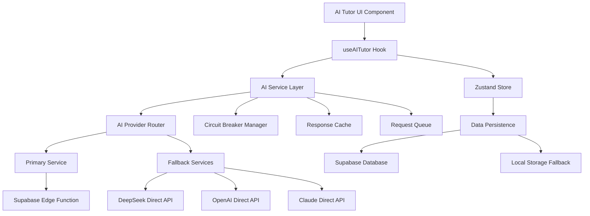

# AI Integration and UI Fix - Design Document

## Overview

This design document outlines the comprehensive solution for fixing AI integration reliability issues and enhancing the user interface of the StudyFlow AI tutor feature. The solution focuses on creating a robust, multi-provider AI service architecture with intelligent fallback mechanisms, enhanced error handling, and a modern, responsive user interface.

## Architecture

### High-Level Architecture



### Service Layer Architecture

The AI service layer will be redesigned with the following components:

1. **AI Provider Router**: Intelligent routing between multiple AI providers
2. **Circuit Breaker Manager**: Enhanced circuit breaker with automatic recovery
3. **Response Cache**: Intelligent caching to reduce API calls and improve performance
4. **Request Queue**: Queue management for rate limiting and retry logic
5. **Fallback Chain**: Cascading fallback system across multiple providers

## Components and Interfaces

### 1. Enhanced AI Service Interface

```typescript
interface AIServiceConfig {
  providers: AIProviderConfig[];
  fallbackChain: string[];
  circuitBreakerConfig: CircuitBreakerConfig;
  cacheConfig: CacheConfig;
  retryConfig: RetryConfig;
}

interface AIProviderConfig {
  id: string;
  name: string;
  type: 'edge-function' | 'direct-api';
  endpoint: string;
  models: string[];
  capabilities: string[];
  priority: number;
  rateLimit: RateLimitConfig;
}

interface EnhancedAIService {
  sendMessage(request: AIRequest): Promise<AIResponse>;
  getAvailableProviders(): AIProviderConfig[];
  switchProvider(providerId: string): void;
  getServiceHealth(): ServiceHealthStatus;
  resetServices(): void;
}
```

### 2. Improved UI Components

#### AITutorEnhanced Component Redesign

- **Responsive Layout**: Mobile-first design with adaptive layouts
- **Real-time Status**: Live service status indicators and health monitoring
- **Enhanced Thinking States**: Rich thinking animations with contextual messages
- **Improved Message Rendering**: Optimized message bubbles with syntax highlighting
- **Accessibility Features**: Full keyboard navigation and screen reader support

#### New Components to Add

1. **ServiceStatusIndicator**: Real-time service health display
2. **ProviderSelector**: AI provider selection with capability indicators
3. **MessageRenderer**: Enhanced message display with markdown and code support
4. **ThinkingIndicator**: Sophisticated thinking state animations
5. **ErrorBoundary**: Graceful error handling with recovery options
6. **OfflineIndicator**: Offline mode detection and messaging

### 3. State Management Enhancements

#### Enhanced Store Structure

```typescript
interface AITutorState {
  // Existing state
  currentSession: ChatSession | null;
  sessions: ChatSession[];
  isLoading: boolean;
  isThinking: boolean;
  error: string | null;
  settings: AITutorSettings;
  thinkingState: ThinkingState;
  
  // New state additions
  serviceHealth: ServiceHealthStatus;
  availableProviders: AIProviderConfig[];
  currentProvider: string;
  requestQueue: QueuedRequest[];
  offlineMode: boolean;
  performanceMetrics: PerformanceMetrics;
}
```

## Data Models

### Enhanced Message Model

```typescript
interface ChatMessage extends BaseEntity {
  role: 'user' | 'assistant' | 'system';
  content: string;
  type: 'text' | 'thinking' | 'error' | 'system';
  metadata: MessageMetadata;
  sessionId: string;
  
  // New fields
  providerId?: string;
  processingTime?: number;
  retryCount?: number;
  cacheHit?: boolean;
}

interface MessageMetadata {
  tokens?: number;
  model?: string;
  temperature?: number;
  reasoning?: string;
  sources?: string[];
  
  // Enhanced metadata
  processingStages?: ProcessingStage[];
  qualityScore?: number;
  confidence?: number;
  fallbackUsed?: boolean;
}
```

### Service Health Model

```typescript
interface ServiceHealthStatus {
  overall: 'healthy' | 'degraded' | 'unhealthy';
  providers: ProviderHealth[];
  lastCheck: Date;
  metrics: HealthMetrics;
}

interface ProviderHealth {
  id: string;
  status: 'online' | 'degraded' | 'offline';
  responseTime: number;
  errorRate: number;
  lastSuccess: Date;
  circuitBreakerState: 'closed' | 'open' | 'half-open';
}
```

## Error Handling

### Comprehensive Error Strategy

1. **Error Classification System**
   - Network errors (connectivity, timeouts)
   - Authentication errors (invalid tokens, expired sessions)
   - API errors (rate limits, invalid requests, server errors)
   - Application errors (validation, state inconsistencies)

2. **Error Recovery Mechanisms**
   - Automatic retry with exponential backoff
   - Provider fallback cascading
   - Circuit breaker automatic reset
   - Local storage fallback for persistence

3. **User-Friendly Error Messages**
   - Contextual error explanations
   - Actionable recovery suggestions
   - Progress indicators during recovery
   - Manual override options

### Error Boundary Implementation

```typescript
interface ErrorBoundaryState {
  hasError: boolean;
  error: Error | null;
  errorInfo: ErrorInfo | null;
  retryCount: number;
  canRecover: boolean;
}

class AITutorErrorBoundary extends Component<Props, ErrorBoundaryState> {
  // Comprehensive error catching and recovery
  // Fallback UI with recovery options
  // Error reporting and logging
}
```

## Testing Strategy

### Unit Testing

1. **Service Layer Tests**
   - AI provider routing logic
   - Circuit breaker functionality
   - Cache hit/miss scenarios
   - Error handling paths
   - Retry mechanisms

2. **Component Tests**
   - UI component rendering
   - User interaction flows
   - Error state handling
   - Accessibility compliance
   - Responsive behavior

3. **Hook Tests**
   - State management logic
   - Side effect handling
   - Error propagation
   - Performance optimization

### Integration Testing

1. **AI Service Integration**
   - End-to-end message flow
   - Provider fallback scenarios
   - Authentication flows
   - Database persistence

2. **UI Integration**
   - Complete user workflows
   - Cross-component communication
   - State synchronization
   - Error recovery flows

### Performance Testing

1. **Load Testing**
   - Concurrent user scenarios
   - High message volume handling
   - Memory usage optimization
   - Response time benchmarks

2. **Stress Testing**
   - Service failure scenarios
   - Network instability simulation
   - Resource exhaustion handling
   - Recovery time measurement

## Implementation Phases

### Phase 1: Core Service Reliability
- Enhanced circuit breaker implementation
- Multi-provider fallback system
- Improved error handling and logging
- Response caching system

### Phase 2: UI/UX Enhancements
- Redesigned AI tutor interface
- Enhanced thinking states and animations
- Improved message rendering
- Accessibility improvements

### Phase 3: Advanced Features
- Multi-provider support UI
- Performance monitoring dashboard
- Advanced caching strategies
- Offline mode support

### Phase 4: Optimization and Polish
- Performance optimizations
- Advanced error recovery
- Enhanced accessibility
- Comprehensive testing

## Security Considerations

### API Key Management
- Secure vault storage for all API keys
- Rotation mechanism for expired keys
- Environment-specific key management
- Audit logging for key access

### Data Protection
- End-to-end encryption for sensitive data
- Input sanitization and validation
- Output filtering for security
- Privacy-compliant data handling

### Authentication and Authorization
- Robust session management
- Token refresh mechanisms
- Role-based access control
- Audit trails for user actions

## Performance Optimizations

### Caching Strategy
- Intelligent response caching based on message similarity
- Cache invalidation policies
- Memory-efficient cache storage
- Cache hit rate monitoring

### Rendering Optimizations
- Virtual scrolling for large chat histories
- Lazy loading of message components
- Optimized re-rendering with React.memo
- Efficient state updates with Zustand

### Network Optimizations
- Request deduplication
- Intelligent retry policies
- Connection pooling
- Bandwidth-aware streaming

## Monitoring and Analytics

### Service Monitoring
- Real-time health dashboards
- Performance metrics collection
- Error rate tracking
- User experience analytics

### User Behavior Analytics
- Feature usage patterns
- Error encounter rates
- Performance impact on user experience
- Conversion and engagement metrics