# Design Document

## Overview

The comprehensive code audit system will be implemented as a multi-phase analysis and remediation framework for the Study Flow AI educational platform. The system will systematically evaluate security vulnerabilities, code quality issues, database integrity, dependency management, feature completeness, and testing infrastructure. The audit framework will leverage both automated tools and manual analysis to achieve enterprise-ready standards.

## Architecture

### Audit Framework Components

```mermaid
graph TB
    A[Audit Controller] --> B[Security Scanner]
    A --> C[Code Quality Analyzer]
    A --> D[Database Auditor]
    A --> E[Dependency Manager]
    A --> F[Feature Validator]
    A --> G[Test Infrastructure]
    
    B --> B1[Auth Flow Scanner]
    B --> B2[API Security Checker]
    B --> B3[RLS Policy Tester]
    B --> B4[Vulnerability Scanner]
    
    C --> C1[Console Log Detector]
    C --> C2[TypeScript Analyzer]
    C --> C3[Dead Code Detector]
    C --> C4[TODO Resolver]
    
    D --> D1[Schema Analyzer]
    D --> D2[Performance Profiler]
    D --> D3[RLS Validator]
    
    E --> E1[Package Scanner]
    E --> E2[Vulnerability Checker]
    E --> E3[License Auditor]
    
    F --> F1[Feature Tester]
    F --> F2[Integration Validator]
    F --> F3[E2E Checker]
    
    G --> G1[Unit Test Generator]
    G --> G2[Integration Test Creator]
    G --> G3[Coverage Reporter]
```



### Technology Stack Integration

The audit system will integrate with the existing technology stack:
- **Frontend**: React 18.3.1 + TypeScript 5.9.2 + Vite 7.1.2
- **Backend**: Supabase (PostgreSQL + Edge Functions)
- **AI Services**: Gemini, Claude (Anthropic), OpenAI
- **Testing**: Vitest 3.2.4 + React Testing Library
- **Security**: Custom API Vault + HMAC signing
- **UI Components**: Radix UI + Tailwind CSS

## Components and Interfaces

### 1. Security Scanner Module

**Purpose**: Comprehensive security vulnerability assessment

**Key Components**:
- `AuthFlowScanner`: Analyzes Supabase Auth + Google OAuth integration
- `APISecurityChecker`: Scans for API key exposure and secure storage
- `RLSPolicyTester`: Validates Row Level Security policies
- `VulnerabilityScanner`: Automated security scanning using npm audit and Snyk

**Interfaces**:
```typescript
interface SecurityScanResult {
  vulnerabilities: SecurityVulnerability[];
  authFlowIssues: AuthFlowIssue[];
  apiSecurityIssues: APISecurityIssue[];
  rlsPolicyIssues: RLSPolicyIssue[];
  overallScore: number;
  recommendations: SecurityRecommendation[];
}

interface SecurityVulnerability {
  severity: 'critical' | 'high' | 'medium' | 'low';
  type: string;
  description: string;
  location: string;
  remediation: string;
}
```

### 2. Code Quality Analyzer

**Purpose**: Identify and resolve code quality issues

**Key Components**:
- `ConsoleLogDetector`: Identifies all 679+ console.log statements
- `TypeScriptAnalyzer`: Finds `any` types and provides type-safe alternatives
- `DeadCodeDetector`: Identifies unused components and imports
- `TODOResolver`: Locates and categorizes TODO items

**Interfaces**:
```typescript
interface CodeQualityReport {
  consoleStatements: ConsoleStatement[];
  typeIssues: TypeIssue[];
  deadCode: DeadCodeItem[];
  todoItems: TODOItem[];
  qualityScore: number;
  fixableIssues: number;
}

interface ConsoleStatement {
  file: string;
  line: number;
  type: 'log' | 'error' | 'warn' | 'debug';
  context: string;
  autoFixable: boolean;
}
```

### 3. Database Auditor

**Purpose**: Ensure database integrity, security, and performance

**Key Components**:
- `SchemaAnalyzer`: Reviews table structures, indexes, and relationships
- `PerformanceProfiler`: Identifies slow queries and optimization opportunities
- `RLSValidator`: Tests RLS policies with different user roles
- `EdgeFunctionScanner`: Scans Edge Functions for SQL injection vulnerabilities

**Interfaces**:
```typescript
interface DatabaseAuditReport {
  schemaIssues: SchemaIssue[];
  performanceIssues: PerformanceIssue[];
  securityIssues: DatabaseSecurityIssue[];
  optimizationRecommendations: OptimizationRecommendation[];
  healthScore: number;
}
```

### 4. Dependency Manager

**Purpose**: Manage package updates and security vulnerabilities

**Key Components**:
- `PackageScanner`: Identifies outdated packages (57+ packages)
- `VulnerabilityChecker`: Scans for known security vulnerabilities
- `LicenseAuditor`: Reviews license compliance
- `UpdatePlanner`: Creates safe update strategy

**Interfaces**:
```typescript
interface DependencyAuditReport {
  outdatedPackages: OutdatedPackage[];
  vulnerabilities: PackageVulnerability[];
  licenseIssues: LicenseIssue[];
  updatePlan: UpdatePlan;
  riskAssessment: RiskAssessment;
}
```

### 5. Feature Validator

**Purpose**: Verify complete functionality of all platform features

**Key Components**:
- `FeatureTester`: Tests all 10 core platform features
- `IntegrationValidator`: Validates AI provider integrations and failover
- `E2EChecker`: End-to-end testing of critical user paths

**Interfaces**:
```typescript
interface FeatureValidationReport {
  featureResults: FeatureTestResult[];
  integrationResults: IntegrationTestResult[];
  e2eResults: E2ETestResult[];
  completenessScore: number;
  criticalIssues: CriticalIssue[];
}
```

### 6. Test Infrastructure Generator

**Purpose**: Implement comprehensive testing framework

**Key Components**:
- `UnitTestGenerator`: Creates unit tests for components and services
- `IntegrationTestCreator`: Builds integration tests for API calls
- `CoverageReporter`: Tracks and reports test coverage (target: 80%)

## Data Models

### Audit Session
```typescript
interface AuditSession {
  id: string;
  startTime: Date;
  endTime?: Date;
  status: 'running' | 'completed' | 'failed';
  phases: AuditPhase[];
  overallScore: number;
  previousScore?: number;
  improvements: Improvement[];
}

interface AuditPhase {
  name: string;
  status: 'pending' | 'running' | 'completed' | 'failed';
  startTime?: Date;
  endTime?: Date;
  results: any;
  issues: Issue[];
}
```

### Issue Tracking
```typescript
interface Issue {
  id: string;
  type: 'security' | 'quality' | 'performance' | 'dependency' | 'feature';
  severity: 'critical' | 'high' | 'medium' | 'low';
  title: string;
  description: string;
  location: string;
  autoFixable: boolean;
  remediation: string;
  status: 'open' | 'in_progress' | 'resolved' | 'ignored';
}
```

## Error Handling

### Audit Process Error Handling
- **Graceful Degradation**: If one audit phase fails, continue with remaining phases
- **Retry Logic**: Implement exponential backoff for network-dependent operations
- **Partial Results**: Save partial results if audit is interrupted
- **Error Reporting**: Detailed error logs with context and remediation steps

### Security-Specific Error Handling
- **API Key Validation**: Verify API keys before testing integrations
- **Rate Limiting**: Respect API rate limits during security scans
- **Permission Errors**: Handle insufficient permissions gracefully
- **Network Timeouts**: Implement appropriate timeouts for external service calls

## Testing Strategy

### Audit Framework Testing
1. **Unit Tests**: Test individual audit components in isolation
2. **Integration Tests**: Test audit phases working together
3. **Mock Testing**: Mock external services (Supabase, AI providers) for consistent testing
4. **Performance Tests**: Ensure audit process doesn't impact application performance

### Security Testing Validation
1. **Vulnerability Injection**: Test detection of known vulnerability patterns
2. **False Positive Detection**: Ensure minimal false positives in security scans
3. **RLS Policy Testing**: Automated testing of RLS policies with different user roles
4. **API Security Testing**: Validate API key exposure detection accuracy

### Code Quality Testing
1. **Pattern Detection**: Test accuracy of console.log and TODO detection
2. **TypeScript Analysis**: Validate type issue detection and suggestions
3. **Dead Code Detection**: Test unused code identification accuracy
4. **Fix Validation**: Ensure automated fixes don't break functionality

## Implementation Phases

### Phase 1: Security Foundation (Days 1-2)
- Implement security scanner framework
- Set up automated vulnerability scanning
- Create RLS policy testing infrastructure
- Establish security scoring system

### Phase 2: Code Quality Infrastructure (Days 3-4)
- Build console.log detection and removal system
- Implement TypeScript analysis tools
- Create dead code detection algorithms
- Set up TODO item tracking

### Phase 3: Database and Dependencies (Days 5-6)
- Implement database schema analysis
- Create performance profiling tools
- Build dependency scanning and update planning
- Set up license compliance checking

### Phase 4: Feature Validation (Days 7-8)
- Create feature testing framework
- Implement AI integration testing
- Build E2E testing infrastructure
- Set up feature completeness tracking

### Phase 5: Testing and Reporting (Days 9-10)
- Implement comprehensive test suite
- Create audit reporting system
- Build dashboard for tracking improvements
- Generate final audit documentation

## Security Considerations

### Audit Process Security
- **Credential Protection**: Ensure audit process doesn't expose sensitive credentials
- **Secure Logging**: Sanitize logs to prevent information leakage
- **Access Control**: Restrict audit functionality to authorized users
- **Data Encryption**: Encrypt audit results and sensitive findings

### API Key Management
- **Vault Integration**: Leverage existing API Vault for secure key storage
- **Key Rotation**: Implement automated key rotation recommendations
- **Usage Monitoring**: Track API key usage patterns for anomaly detection
- **Expiration Management**: Monitor and alert on key expiration

## Performance Optimization

### Audit Efficiency
- **Parallel Processing**: Run independent audit phases concurrently
- **Incremental Analysis**: Only re-analyze changed files when possible
- **Caching**: Cache analysis results for unchanged components
- **Resource Management**: Monitor and limit resource usage during audits

### Database Performance
- **Query Optimization**: Identify and optimize slow database queries
- **Index Analysis**: Recommend optimal database indexes
- **Connection Pooling**: Ensure efficient database connection usage
- **Monitoring Integration**: Integrate with existing performance monitoring