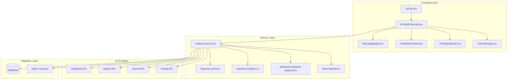

# AI Tutor Implementation Architecture

## Table of Contents
1. [Overview](#overview)
2. [Architecture Overview](#architecture-overview)
3. [Core Components](#core-components)
4. [Service Layer](#service-layer)
5. [Data Models & Interfaces](#data-models--interfaces)
6. [Features & Capabilities](#features--capabilities)
7. [Integration Points](#integration-points)
8. [UI/UX Implementation](#uiux-implementation)
9. [Technical Implementation Details](#technical-implementation-details)
10. [Database Schema](#database-schema)
11. [Development Guidelines](#development-guidelines)

---

## Overview

The AI Tutor system is a sophisticated educational assistant built with React and TypeScript, featuring multi-provider AI integration, professional response processing, and comprehensive session management. The system supports DeepSeek, OpenAI, Gemini, and Claude AI providers with advanced caching, optimization, and reliability features.

### Key Features
- **Multi-provider AI Integration** - Seamless switching between AI providers
- **Professional Response Processing** - Advanced content optimization and quality scoring
- **Session Management** - Persistent chat history with search and organization
- **Educational Content Validation** - Specialized processing for learning content
- **Reliability & Performance** - Circuit breakers, caching, and fallback mechanisms
- **Responsive UI** - Mobile-optimized interface with professional/casual views

---

## Architecture Overview



### Data Flow
1. **User Input** → AITutorEnhanced component
2. **Message Processing** → unified-ai-service.ts
3. **Intent Detection** → Determines response type and optimization strategy
4. **Cache Check** → Attempts to serve cached response
5. **AI Provider Call** → Routes to appropriate AI service
6. **Response Processing** → Optimization, formatting, and quality assessment
7. **UI Rendering** → MessageBubble with enhanced features
8. **Persistence** → Database storage and session management

---

## Core Components

### 1. AITutor.tsx
**Entry Point Component**
- **Location**: `src/components/ai-tutor/AITutor.tsx`
- **Purpose**: Main export that re-routes to enhanced implementation
- **Key Features**: Backward compatibility with legacy version

```typescript
// Re-export pattern for seamless integration
export { AITutorEnhanced as AITutor } from './AITutorEnhanced';
```

### 2. AITutorEnhanced.tsx
**Primary Implementation Component**
- **Location**: `src/components/ai-tutor/AITutorEnhanced.tsx`
- **Purpose**: Main chat interface with professional features
- **Key Features**:
  - Multi-provider AI integration
  - Session management
  - Professional response processing
  - Mobile-responsive sidebar
  - Timeout handling
  - Quality scoring and optimization

**Props Interface**:
```typescript
interface AITutorEnhancedProps {
  subject?: string;
  topic?: string;
  className?: string;
}
```

**State Management**:
- Messages array with metadata
- Session management
- UI state (sidebar, modals, loading)
- Optimization and caching status

### 3. MessageBubble.tsx
**Message Display Component**
- **Location**: `src/components/ai-tutor/MessageBubble.tsx`
- **Purpose**: Renders individual chat messages with advanced features
- **Key Features**:
  - Markdown rendering with syntax highlighting
  - Professional/simple view toggle
  - Copy functionality
  - User feedback system
  - Quality indicators
  - Bookmark functionality

**Props Interface**:
```typescript
interface MessageBubbleProps {
  role: 'user' | 'assistant';
  content: string;
  timestamp: Date;
  isBookmarked?: boolean;
  onBookmark?: () => void;
  onFeedback?: (type: 'helpful' | 'not_helpful') => void;
  className?: string;
  cached?: boolean;
  optimized?: boolean;
  qualityScore?: number;
  processingResult?: ProcessingResult;
  onProgressUpdate?: (taskId: string, completed: boolean) => void;
}
```

### 4. ChatHistoryPanel.tsx
**Session Management Component**
- **Location**: `src/components/ai-tutor/ChatHistoryPanel.tsx`
- **Purpose**: Manages chat sessions with search and organization
- **Key Features**:
  - Session grouping by time
  - Search functionality
  - Collapsible/expandable interface
  - New session creation
  - Session deletion

**Props Interface**:
```typescript
interface ChatHistoryPanelProps {
  sessions: AISession[];
  activeSession?: AISession | null;
  onSessionSelect: (session: AISession) => void;
  onSessionDelete?: (sessionId: string) => void;
  onNewSession: () => void;
  isCollapsed?: boolean;
  onToggleCollapse?: () => void;
  className?: string;
}
```

### 5. Supporting Components

#### ThinkingIndicator.tsx
- **Purpose**: Loading states and animations
- **Features**: Multiple animation variants, customizable sizing

#### TimeoutPopup.tsx
- **Purpose**: Connection timeout notifications
- **Features**: Duration tracking, user-friendly messaging

#### SessionPreview.tsx
- **Purpose**: Individual session preview cards
- **Features**: Message count, subject badges, quick actions

---

## Service Layer

### 1. unified-ai-service.ts
**Core AI Service**
- **Location**: `src/services/unified-ai-service.ts`
- **Purpose**: Central AI provider management and orchestration
- **Key Features**:
  - Multi-provider support (DeepSeek, OpenAI, Gemini, Claude)
  - Session management
  - Professional response processing
  - Circuit breaker patterns
  - Fallback mechanisms
  - Intent detection integration

**Key Methods**:
```typescript
class UnifiedAIService {
  async createSession(subject: string, provider?: AIProvider): Promise<AISession>
  async sendMessage(sessionId: string, content: string, subject?: string, context?: MessageContext): Promise<Message>
  async getAvailableProviders(): Promise<ProviderInfo[]>
  getSession(sessionId: string): AISession | undefined
  async deleteSession(sessionId: string): Promise<boolean>
}
```

### 2. Response Processing Services

#### deepseek-response-optimizer.ts
- **Purpose**: Response enhancement and optimization
- **Features**: Educational content formatting, quality improvement

#### response-cache.ts
- **Purpose**: Intelligent response caching
- **Features**: Cache key generation, TTL management, quality-based caching

#### response-analytics.ts
- **Purpose**: Usage tracking and analytics
- **Features**: Response quality metrics, user feedback tracking

### 3. AI Integration Services

#### intent-detector.ts
- **Purpose**: User intent classification
- **Features**: Casual vs educational intent detection, confidence scoring

#### educational-content-validator.ts
- **Purpose**: Content validation for educational appropriateness
- **Features**: Educational quality assessment, content filtering

---

## Data Models & Interfaces

### Core Types

```typescript
// Message Interface
interface Message {
  id: string;
  role: 'user' | 'assistant' | 'system';
  content: string;
  timestamp: Date;
  isError?: boolean;
  feedback?: 'helpful' | 'not_helpful' | null;
  cached?: boolean;
  optimized?: boolean;
  qualityScore?: number;
  processingResult?: ProcessingResult;
}

// AI Session Interface
interface AISession {
  id: string;
  subject: string;
  messages: Message[];
  createdAt: Date;
  lastActive: Date;
  provider: AIProvider;
}

// AI Provider Types
type AIProvider = 'openai' | 'gemini' | 'claude' | 'deepseek';

// AI Response Interface
interface AIResponse {
  provider: string;
  model: string;
  content: string;
  usage?: {
    prompt_tokens?: number;
    completion_tokens?: number;
    total_tokens?: number;
  };
  responseType?: 'explanation' | 'study_plan' | 'practice' | 'concept';
  metadata?: ResponseMetadata;
}

// Message Context Interface
interface MessageContext {
  topic?: string;
  userLevel?: 'beginner' | 'intermediate' | 'advanced';
  responseType?: 'explanation' | 'study_plan' | 'practice' | 'concept';
  context?: any[];
  learningObjectives?: string[];
  timeConstraint?: string;
  difficulty?: 'easy' | 'medium' | 'hard';
}
```

### Professional Processing Types

```typescript
// Processing Result Interface
interface ProcessingResult {
  qualityAssessment: QualityAssessment;
  formattedResponse: FormattedResponse;
  processingMetadata: ProcessingMetadata;
}

// Quality Assessment Interface
interface QualityAssessment {
  overallScore: number;
  criteria: {
    clarity: number;
    accuracy: number;
    relevance: number;
    completeness: number;
  };
  feedback: string[];
}

// Intent Detection Interface
interface MessageIntent {
  type: 'greeting' | 'casual' | 'educational' | 'technical';
  confidence: number;
  responseMode: 'casual' | 'professional';
  suggestedResponseType?: 'explanation' | 'study_plan' | 'practice' | 'concept';
}
```

---

## Features & Capabilities

### 1. Multi-Provider AI Integration
- **Supported Providers**: DeepSeek (primary), OpenAI, Gemini, Claude
- **Dynamic Provider Selection**: Based on availability and user preference
- **Unified API**: Consistent interface across all providers
- **Provider Health Monitoring**: Circuit breaker patterns for reliability

### 2. Professional Response Processing
- **Content Optimization**: Educational content enhancement
- **Quality Scoring**: Automated quality assessment (0-100 scale)
- **Response Formatting**: Structured content with metadata
- **Educational Validation**: Content appropriateness verification

### 3. Intelligent Caching
- **Response Caching**: Quality-based cache duration
- **Cache Key Generation**: Context-aware key creation
- **Cache Statistics**: Hit rate monitoring and optimization
- **Smart Invalidation**: Context-based cache refresh

### 4. Session Management
- **Persistent Sessions**: Database-backed session storage
- **Session Organization**: Time-based grouping and search
- **Cross-Device Sync**: Supabase-powered synchronization
- **Session Analytics**: Usage patterns and insights

### 5. Educational Features
- **Study Plan Generation**: Structured learning paths
- **Concept Explanation**: Multi-level explanations
- **Practice Question Generation**: Adaptive difficulty
- **Progress Tracking**: Learning objective completion

### 6. User Experience Features
- **Responsive Design**: Mobile-first approach
- **Professional/Simple Views**: Dual rendering modes
- **Real-time Feedback**: User satisfaction tracking
- **Accessibility**: WCAG compliance and keyboard navigation

---

## Integration Points

### 1. Supabase Integration
- **Database Tables**:
  - `ai_tutor_sessions` - Session metadata
  - `ai_tutor_messages` - Message history
  - `ai_tutor_study_plans` - Generated study plans
  - `ai_tutor_concepts` - Concept explanations
  - `ai_tutor_practice_questions` - Practice questions

- **Edge Functions**:
  - `deepseek-ai-professional` - Professional processing endpoint
  - `ai-proxy-secure` - Legacy AI proxy
  - `auth-validation` - Authentication verification

### 2. Authentication
- **Supabase Auth**: User authentication and session management
- **Row Level Security (RLS)**: Database access control
- **API Key Management**: Secure key storage and retrieval

### 3. External APIs
- **DeepSeek API**: Primary AI provider
- **OpenAI API**: Alternative provider
- **Google Gemini API**: Alternative provider
- **Anthropic Claude API**: Alternative provider

---

## UI/UX Implementation

### 1. Layout Architecture
```typescript
// Main layout structure
<Card className="ai-tutor-container">
  <CardHeader /> // Title and controls
  <CardContent className="chat-main-layout">
    <ChatHistoryPanel /> // Collapsible sidebar
    <div className="chat-messages-wrapper">
      <ScrollArea /> // Message container
      <div className="chat-input-container" /> // Input area
    </div>
  </CardContent>
</Card>
```

### 2. Responsive Design
- **Mobile-First**: Progressive enhancement for larger screens
- **Sidebar Behavior**: Collapsible on mobile, persistent on desktop
- **Touch Optimization**: Gesture-friendly interactions
- **Viewport Adaptation**: Dynamic sizing based on screen real estate

### 3. Visual Design Patterns
- **Message Bubbles**: Distinctive styling for user vs assistant messages
- **Quality Indicators**: Visual feedback for response quality
- **Loading States**: Professional thinking indicators
- **Status Badges**: Cache hits, optimization status, quality scores

### 4. Interaction Patterns
- **Quick Actions**: One-click access to common functions
- **Context Menus**: Right-click functionality for power users
- **Keyboard Shortcuts**: Accessibility and power user features
- **Progressive Disclosure**: Hide complexity until needed

---

## Technical Implementation Details

### 1. State Management
- **Local State**: React hooks for component-level state
- **Service State**: Singleton pattern for AI service
- **Persistence**: Supabase for cross-session state
- **Cache Management**: In-memory and persistent caching

### 2. Error Handling
- **Circuit Breakers**: Prevent cascade failures
- **Graceful Degradation**: Fallback responses when services fail
- **User-Friendly Messages**: Clear error communication
- **Retry Logic**: Intelligent retry with backoff

### 3. Performance Optimizations
- **Lazy Loading**: Component and content loading
- **Memoization**: React.memo and useMemo optimizations
- **Virtual Scrolling**: Efficient large conversation handling
- **Bundle Splitting**: Code splitting for faster initial loads

### 4. Security Considerations
- **Input Sanitization**: DOMPurify for safe content rendering
- **XSS Protection**: Content Security Policy implementation
- **API Key Security**: Environment variable management
- **Rate Limiting**: Request throttling and abuse prevention

---

## Database Schema

### Core Tables

#### ai_tutor_sessions
```sql
CREATE TABLE ai_tutor_sessions (
    id UUID PRIMARY KEY DEFAULT gen_random_uuid(),
    user_id UUID REFERENCES auth.users(id),
    subject TEXT NOT NULL,
    subject_name TEXT,
    ai_provider TEXT DEFAULT 'deepseek',
    status TEXT DEFAULT 'active',
    session_type TEXT DEFAULT 'chat',
    is_archived BOOLEAN DEFAULT false,
    created_at TIMESTAMP WITH TIME ZONE DEFAULT NOW(),
    updated_at TIMESTAMP WITH TIME ZONE DEFAULT NOW()
);
```

#### ai_tutor_messages
```sql
CREATE TABLE ai_tutor_messages (
    id UUID PRIMARY KEY DEFAULT gen_random_uuid(),
    session_id UUID REFERENCES ai_tutor_sessions(id),
    user_id UUID REFERENCES auth.users(id),
    role TEXT NOT NULL CHECK (role IN ('user', 'assistant', 'system')),
    content TEXT NOT NULL,
    subject TEXT,
    topic TEXT,
    feedback TEXT CHECK (feedback IN ('helpful', 'not_helpful')),
    quality_score INTEGER,
    cached BOOLEAN DEFAULT false,
    optimized BOOLEAN DEFAULT false,
    processing_result JSONB,
    response_type TEXT,
    created_at TIMESTAMP WITH TIME ZONE DEFAULT NOW()
);
```

#### ai_tutor_study_plans
```sql
CREATE TABLE ai_tutor_study_plans (
    id UUID PRIMARY KEY DEFAULT gen_random_uuid(),
    user_id UUID REFERENCES auth.users(id),
    subject TEXT NOT NULL,
    topic TEXT,
    plan_content TEXT NOT NULL,
    duration_weeks INTEGER DEFAULT 4,
    is_active BOOLEAN DEFAULT true,
    created_at TIMESTAMP WITH TIME ZONE DEFAULT NOW()
);
```

### Indexes and Performance
```sql
-- Performance indexes
CREATE INDEX idx_ai_tutor_messages_session_id ON ai_tutor_messages(session_id);
CREATE INDEX idx_ai_tutor_messages_user_id ON ai_tutor_messages(user_id);
CREATE INDEX idx_ai_tutor_sessions_user_id ON ai_tutor_sessions(user_id);
CREATE INDEX idx_ai_tutor_sessions_updated_at ON ai_tutor_sessions(updated_at DESC);
```

---

## Development Guidelines

### 1. Component Development
- **TypeScript First**: Strict typing for all components
- **Props Documentation**: Clear interface definitions
- **Error Boundaries**: Component-level error handling
- **Testing**: Unit tests for all components

### 2. Service Development
- **Single Responsibility**: One service, one purpose
- **Dependency Injection**: Testable service architecture
- **Error Propagation**: Consistent error handling patterns
- **Monitoring**: Comprehensive logging and metrics

### 3. Code Quality Standards
- **ESLint Configuration**: Strict linting rules
- **Prettier Formatting**: Consistent code formatting
- **Type Safety**: No `any` types in production code
- **Documentation**: JSDoc comments for public APIs

### 4. Testing Strategy
- **Unit Tests**: Component and service testing
- **Integration Tests**: Full feature testing
- **E2E Tests**: User journey validation
- **Performance Tests**: Load and stress testing

### 5. Deployment Considerations
- **Environment Variables**: Secure configuration management
- **Health Checks**: Service availability monitoring
- **Performance Monitoring**: Real-time metrics collection
- **Error Tracking**: Comprehensive error reporting

---

## File Structure Summary

```
src/components/ai-tutor/
├── AITutor.tsx                    # Main entry point (re-export)
├── AITutorEnhanced.tsx           # Primary implementation
├── MessageBubble.tsx             # Message display component
├── ChatHistoryPanel.tsx          # Session management
├── SessionPreview.tsx            # Session preview cards
├── ThinkingIndicator.tsx         # Loading animations
├── TimeoutPopup.tsx              # Timeout notifications
├── DeepSeekRecommendation.tsx    # Provider recommendations
├── AIHistoryModal.tsx            # History modal dialog
├── AITutorEnhanced.css          # Component-specific styles
├── ConceptHistory.tsx            # Concept tracking
├── PracticeHistory.tsx           # Practice question history
├── StudyPlanHistory.tsx          # Study plan management
├── EnhancedAITutor.tsx          # Enhanced features wrapper

src/services/
├── unified-ai-service.ts         # Core AI service
├── deepseek-response-optimizer.ts # Response optimization
├── response-cache.ts            # Caching layer
├── response-analytics.ts        # Analytics tracking
├── ai-response-filter.ts        # Content filtering
├── ai/
│   ├── intent-detector.ts       # Intent classification
│   └── educational-content-validator.ts # Content validation
├── deepseek/
│   ├── prompt-templates.ts      # Prompt management
│   ├── post-processing-pipeline.ts # Response processing
│   └── response-formatter.ts    # Response formatting
├── reliability/
│   └── circuit-breaker.ts       # Reliability patterns
└── monitoring/
    └── production-monitor.ts     # Health monitoring
```

This architecture provides a scalable, maintainable, and feature-rich AI tutoring system that can adapt to various educational contexts while maintaining high performance and reliability standards.